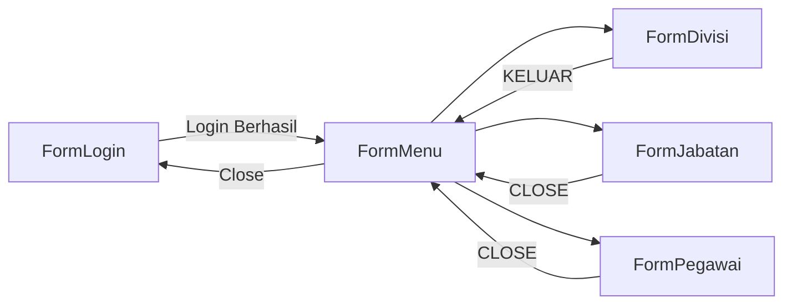
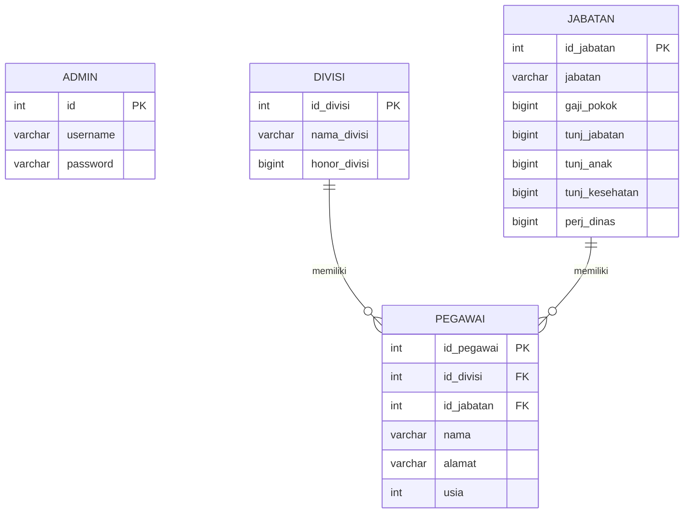
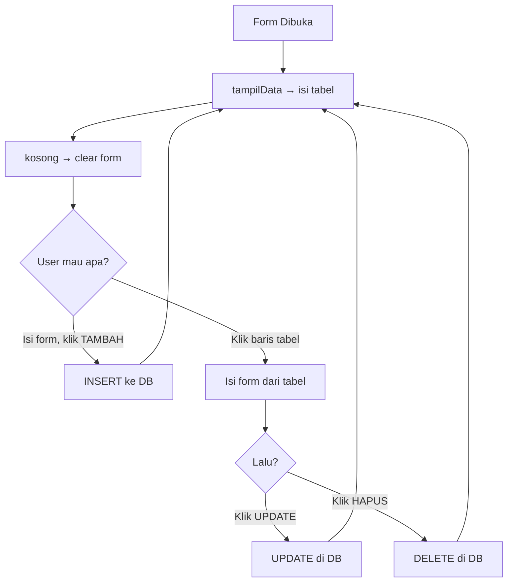

# 📖 Penjelasan Lengkap Projek PBO Pegawai

## 🏗️ Gambaran Besar (Big Picture)

Projek ini adalah **Sistem Manajemen Pegawai** desktop berbasis:
- **Java Swing** → buat GUI (tampilan visual / form)
- **MySQL** → buat database (penyimpanan data)
- **JDBC** → jembatan Java ↔ MySQL

### Alur Kerja Aplikasi



**Penjelasan:** User login dulu → masuk ke menu utama → dari situ bisa buka form Divisi, Jabatan, atau Pegawai → tiap form punya operasi **CRUD** (Create, Read, Update, Delete).

---

## 🗄️ File 1: `db_pegawai.sql` — Database

[db_pegawai.sql](file:///e:/FIle%20User%20Di%20SSD/OneDrive/Documents/NetBeansProjects/pbo-pegawai/db_pegawai.sql)

Ini bukan file Java, tapi file SQL buat bikin database. Ada **4 tabel**:

### Diagram Relasi (ERD)



### Penjelasan Relasi:
| Konsep | Artinya |
|--------|---------|
| **PRIMARY KEY (PK)** | ID unik tiap baris, gak boleh duplikat |
| **FOREIGN KEY (FK)** | Kolom yang **nge-refer** ke tabel lain |
| `pegawai.id_divisi` → `divisi.id_divisi` | Setiap pegawai **punya 1 divisi** |
| `pegawai.id_jabatan` → `jabatan.id_jabatan` | Setiap pegawai **punya 1 jabatan** |

> [!TIP]
> Kalau ditanya guru: "Kenapa pegawai pake Foreign Key?" → Jawab: **Supaya data konsisten. Kita gak bisa masukin pegawai dengan divisi yang gak ada di tabel divisi.**

---

## 🔌 File 2: `Koneksi.java` — Koneksi Database

[Koneksi.java](file:///e:/FIle%20User%20Di%20SSD/OneDrive/Documents/NetBeansProjects/pbo-pegawai/src/main/java/com/mycompany/projekpbo/Koneksi.java)

```java
public class Koneksi {
    public static String URL = "jdbc:mysql://localhost:3306/db_pegawai";
    public static String USER = "root";
    public static String PW = "";
    
    public static Connection getConnection() throws SQLException {
        return DriverManager.getConnection(URL, USER, PW);
    }
}
```

### Apa yang terjadi di sini?

| Baris | Penjelasan |
|-------|------------|
| `public static String URL` | Alamat database: protocol `jdbc:mysql`, host `localhost`, port `3306`, nama database `db_pegawai` |
| `public static String USER` | Username MySQL (default `root`) |
| `public static String PW` | Password MySQL |
| `public static Connection getConnection()` | Method **static** → bisa dipanggil tanpa bikin objek: `Koneksi.getConnection()` |
| `DriverManager.getConnection(...)` | JDBC bawaan Java buat buka koneksi ke MySQL |
| `throws SQLException` | Kalau koneksi gagal, error di-lempar keluar (biar yang manggil yang handle) |

### Konsep PBO di sini:
- **`static`** → method/variabel milik **class**, bukan milik **objek**. Jadi gak perlu `new Koneksi()`, langsung `Koneksi.getConnection()`
- **Encapsulation** → semua detail koneksi (URL, user, password) dikumpulin di 1 class

> [!IMPORTANT]
> Method `main()` di class ini cuma buat **testing** koneksi doang. Bukan entry point utama aplikasi.

---

## 🔑 File 3: `ItemCombo.java` — Helper Untuk ComboBox

[ItemCombo.java](file:///e:/FIle%20User%20Di%20SSD/OneDrive/Documents/NetBeansProjects/pbo-pegawai/src/main/java/com/mycompany/projekpbo/ItemCombo.java)

```java
public class ItemCombo {
    private String key;   // Nyimpen ID (misal: "1")
    private String value; // Nyimpen Nama (misal: "KEUANGAN")

    public ItemCombo(String key, String value) {
        this.key = key;
        this.value = value;
    }

    public String getKey() { return key; }
    public String getValue() { return value; }

    @Override
    public String toString() {
        return value; // ← INI PENTING!
    }
}
```

### Kenapa class ini ada?

Masalahnya: di `FormPegawai`, lu butuh **ComboBox** dropdown buat pilih Divisi & Jabatan. Yang user lihat = **nama** (contoh: "KEUANGAN"), tapi yang disimpan ke database = **ID** (contoh: "1").

**Solusinya:** bikin class `ItemCombo` yang nyimpen **dua-duanya** sekaligus.

### Trik `toString()`:
- Pas Java nampilin item di ComboBox, dia panggil `toString()` secara otomatis
- Karena kita override `toString()` biar return `value` (nama), maka yang **muncul di dropdown = nama**
- Tapi di belakang layar, kita tetep bisa ambil `getKey()` buat dapet **ID-nya**

### Konsep PBO di sini:
| Konsep | Penjelasan |
|--------|------------|
| **Encapsulation** | `key` & `value` di-set `private`, diakses lewat getter |
| **Constructor** | `public ItemCombo(String key, String value)` → cara bikin objek baru |
| **Override** | `@Override toString()` → nge-timpa method bawaan `Object` |
| **Getter** | `getKey()`, `getValue()` → akses data private dari luar |

---

## 🔐 File 4: `FormLogin.java` — Halaman Login

[FormLogin.java](file:///e:/FIle%20User%20Di%20SSD/OneDrive/Documents/NetBeansProjects/pbo-pegawai/src/main/java/com/mycompany/projekpbo/FormLogin.java)

### Struktur:
```
FormLogin extends JFrame
├── initComponents()     → [AUTO-GENERATED] bikin tampilan (label, text field, tombol)
├── btnLoginActionPerformed()  → logika login
├── btnCloseActionPerformed()  → tutup aplikasi
└── main()               → entry point aplikasi
```

### Logika Login (yang paling penting):

```java
private void btnLoginActionPerformed(...) {
    String sql = "SELECT * FROM admin WHERE username = ? AND password = ?";
    // 1. Buka koneksi
    Connection conn = Koneksi.getConnection();
    // 2. Siapkan query dengan parameter
    PreparedStatement pst = conn.prepareStatement(sql);
    pst.setString(1, txtUsername.getText());  // isi parameter ke-1
    pst.setString(2, txtPassword.getText());  // isi parameter ke-2
    // 3. Jalankan query
    ResultSet rs = pst.executeQuery();
    // 4. Cek hasilnya
    if (rs.next()) {
        // Ada baris → login berhasil
        this.dispose();            // tutup form login
        new FormMenu().setVisible(true);  // buka form menu
    } else {
        // Gak ada baris → username/password salah
        JOptionPane.showMessageDialog(null, "Login Gagal...");
    }
}
```

### Alur step-by-step:
1. User isi `txtUsername` dan `txtPassword`
2. Klik tombol **Login**
3. Java bikin query SQL: `SELECT * FROM admin WHERE username = 'admin' AND password = 'admin123'`
4. Kirim ke database lewat `Koneksi.getConnection()`
5. Kalau dapet hasil → login sukses → tutup FormLogin, buka FormMenu
6. Kalau gak dapet → muncul dialog "Login Gagal"

### Konsep penting:
| Konsep | Penjelasan |
|--------|------------|
| **PreparedStatement** | Query SQL pakai `?` sebagai placeholder → aman dari **SQL Injection** |
| **ResultSet** | Hasil query. `rs.next()` = cek apakah ada baris selanjutnya |
| **`this.dispose()`** | Tutup window yang sekarang |
| **Event Handler** | `btnLoginActionPerformed` dipanggil otomatis waktu tombol diklik |
| **`extends JFrame`** | Inheritance → FormLogin **mewarisi** semua kemampuan JFrame (window) |

---

## 📋 File 5: `FormMenu.java` — Menu Utama

[FormMenu.java](file:///e:/FIle%20User%20Di%20SSD/OneDrive/Documents/NetBeansProjects/pbo-pegawai/src/main/java/com/mycompany/projekpbo/FormMenu.java)

### Struktur Menu:
```
JMenuBar
├── == Divisi ==
│   ├── Form Divisi    → buka FormDivisi
│   └── Close          → balik ke FormLogin
├── == Jabatan ==
│   ├── Form Jabatan   → buka FormJabatan
│   └── Close          → balik ke FormLogin
└── == Pegawai ==
    ├── Form Pegawai   → buka FormPegawai
    └── Close          → balik ke FormLogin
```

### Pola Navigasi:
```java
// Buka form baru
private void btnMenuDivisiMouseClicked(...) {
    FormDivisi formDivisi = new FormDivisi();  // bikin objek form baru
    formDivisi.setVisible(true);                // tampilin
    this.dispose();                             // tutup form menu
}

// Balik ke login
private void btnMenuDivisiCloseMouseClicked(...) {
    this.dispose();
    FormLogin formLogin = new FormLogin();
    formLogin.setVisible(true);
}
```

### Konsep PBO:
- **Membuat objek** → `new FormDivisi()` = bikin instance baru dari class FormDivisi
- **Memanggil method** → `.setVisible(true)` = tampilin form

> [!NOTE]
> Pola navigasi di semua menu **sama persis**: bikin objek form baru → tampilin → tutup form lama. Ini pola standar navigasi di Java Swing.

---

## 🏢 File 6: `FormDivisi.java` — CRUD Divisi

[FormDivisi.java](file:///e:/FIle%20User%20Di%20SSD/OneDrive/Documents/NetBeansProjects/pbo-pegawai/src/main/java/com/mycompany/projekpbo/FormDivisi.java)

### Komponen di form ini:
| Komponen | Fungsi |
|----------|--------|
| `txtIdDivisi` | ID divisi (auto dari DB, **gak bisa diedit**) |
| `txtNamaDivisi` | Nama divisi |
| `txtHonorDivisi` | Honor divisi |
| `tableDivisi` | Tabel buat nampilin semua data divisi |
| `btnTambah` | Tombol insert data baru |
| `btnUpdate` | Tombol update data |
| `btnHapus` | Tombol hapus data |
| `btnKeluar` | Balik ke menu |

### Method-method penting:

#### 1. `tampilData()` — READ (Baca semua data)
```java
private void tampilData() {
    DefaultTableModel model = new DefaultTableModel();
    model.addColumn("ID DIVISI");
    model.addColumn("NAMA DIVISI");
    model.addColumn("HONOR DIVISI");

    String sql = "SELECT * FROM divisi";
    Statement stm = conn.createStatement();
    ResultSet rs = stm.executeQuery(sql);

    while (rs.next()) {
        model.addRow(new Object[]{
            rs.getString("id_divisi"),
            rs.getString("nama_divisi"),
            rs.getString("honor_divisi")
        });
    }
    tableDivisi.setModel(model);
}
```
**Penjelasan:**
1. Bikin model tabel (kolom: ID, Nama, Honor)
2. Query `SELECT * FROM divisi` → ambil semua data
3. Loop `while(rs.next())` → tiap baris ditambahin ke model
4. Pasang model ke `tableDivisi`

#### 2. `btnTambahActionPerformed()` — CREATE (Tambah data)
```java
String sql = "INSERT INTO divisi (nama_divisi, honor_divisi) VALUES (?, ?)";
PreparedStatement pst = conn.prepareStatement(sql);
pst.setString(1, txtNamaDivisi.getText());
pst.setString(2, txtHonorDivisi.getText());
pst.execute();
```
**Penjelasan:** `?` diganti sama isi text field. Setelah insert → refresh tabel & kosongkan form.

#### 3. `btnUpdateActionPerformed()` — UPDATE (Edit data)
```java
String sql = "UPDATE divisi SET nama_divisi=?, honor_divisi=? WHERE id_divisi=?";
```
**Penjelasan:** Update berdasarkan `WHERE id_divisi=?`. ID diambil dari `txtIdDivisi` yang terisi waktu klik baris tabel.

#### 4. `btnHapusActionPerformed()` — DELETE (Hapus data)
```java
String sql = "DELETE FROM divisi WHERE id_divisi=?";
```

#### 5. `tableDivisiMouseClicked()` — Klik baris tabel
```java
int baris = tableDivisi.getSelectedRow();
txtIdDivisi.setText(tableDivisi.getValueAt(baris, 0).toString());
txtNamaDivisi.setText(tableDivisi.getValueAt(baris, 1).toString());
txtHonorDivisi.setText(tableDivisi.getValueAt(baris, 2).toString());
```
**Penjelasan:** Waktu klik baris di tabel → data baris itu diisi ke text field, siap buat di-update/hapus.

#### 6. `kosong()` — Reset form
```java
private void kosong() {
    txtIdDivisi.setText("");
    txtNamaDivisi.setText("");
    txtHonorDivisi.setText("");
    txtIdDivisi.setEditable(false);  // ID gak boleh diedit
    txtNamaDivisi.requestFocus();    // Fokus ke nama
}
```

### Pola CRUD di FormDivisi:



---

## 💼 File 7: `FormJabatan.java` — CRUD Jabatan

[FormJabatan.java](file:///e:/FIle%20User%20Di%20SSD/OneDrive/Documents/NetBeansProjects/pbo-pegawai/src/main/java/com/mycompany/projekpbo/FormJabatan.java)

**Polanya 100% sama kayak FormDivisi**, cuma beda di:
- Lebih banyak field (7 kolom: ID, Jabatan, Gaji Pokok, Tunj. Jabatan, Tunj. Anak, Tunj. Kesehatan, Perj. Dinas)
- Ada **konfirmasi dialog** sebelum hapus:
```java
int tanya = JOptionPane.showConfirmDialog(null, "Yakin mau hapus?", "Konfirmasi", JOptionPane.YES_NO_OPTION);
if (tanya == JOptionPane.YES_OPTION) {
    // baru hapus
}
```

---

## 👨‍💼 File 8: `FormPegawai.java` — CRUD Pegawai (PALING KOMPLEKS)

[FormPegawai.java](file:///e:/FIle%20User%20Di%20SSD/OneDrive/Documents/NetBeansProjects/pbo-pegawai/src/main/java/com/mycompany/projekpbo/FormPegawai.java)

### Kenapa paling kompleks?
Karena pegawai **berelasi** dengan tabel divisi dan jabatan (pakai Foreign Key). Jadi butuh:
1. **ComboBox** buat pilih divisi & jabatan (bukan text field biasa)
2. **SQL JOIN** buat nampilin data
3. **Logic matching ComboBox** waktu klik tabel

### Method-method khusus:

#### 1. `isiComboDivisi()` & `isiComboJabatan()` — Isi dropdown

```java
private void isiComboDivisi() {
    ResultSet rs = stm.executeQuery("SELECT * FROM divisi");
    while(rs.next()) {
        String id = rs.getString("id_divisi");
        String nama = rs.getString("nama_divisi");
        cbDivisi.addItem(new ItemCombo(id, nama));  // ← Pake ItemCombo!
    }
}
```

**Alur:**
1. Query semua divisi dari DB
2. Tiap baris → bikin objek `ItemCombo(id, nama)`
3. Tambahin ke ComboBox `cbDivisi`
4. Yang muncul di dropdown = `nama` (karena `toString()` return `value`)
5. Tapi ID tetep bisa diambil pake `getKey()`

#### 2. `tampilData()` — READ pakai JOIN

```java
String sql = "SELECT pegawai.*, divisi.nama_divisi, jabatan.jabatan " +
             "FROM pegawai " +
             "INNER JOIN divisi ON pegawai.id_divisi = divisi.id_divisi " +
             "INNER JOIN jabatan ON pegawai.id_jabatan = jabatan.id_jabatan";
```

**Penjelasan `INNER JOIN`:**
- Tabel `pegawai` nyimpen `id_divisi` (angka), bukan nama divisi
- Kalau cuma `SELECT * FROM pegawai`, yang muncul di tabel = angka (contoh: "1", "2")
- Pakai **JOIN** → gabungin tabel pegawai + divisi + jabatan → yang muncul = **nama** divisi & jabatan

#### 3. `btnSimpanActionPerformed()` — INSERT pakai ComboBox

```java
// Ambil ID Divisi dari ComboBox
ItemCombo divisi = (ItemCombo) cbDivisi.getSelectedItem();
pst.setString(2, divisi.getKey());  // Yang disimpan ke DB = ID, bukan nama!

// Ambil ID Jabatan dari ComboBox
ItemCombo jabatan = (ItemCombo) cbJabatan.getSelectedItem();
pst.setString(3, jabatan.getKey());
```

**Penjelasan:**
1. `cbDivisi.getSelectedItem()` → ambil item yang dipilih (tipe Object)
2. `(ItemCombo)` → **casting** ke tipe ItemCombo
3. `.getKey()` → ambil ID-nya

#### 4. `tablePegawaiMouseClicked()` — Match ComboBox saat klik tabel

```java
String namaDivisiTabel = tablePegawai.getValueAt(baris, 2).toString();

// Loop ComboBox buat nyari yg cocok
for (int i = 0; i < cbDivisi.getItemCount(); i++) {
    if (cbDivisi.getItemAt(i).toString().equals(namaDivisiTabel)) {
        cbDivisi.setSelectedIndex(i);
        break;
    }
}
```

**Kenapa ribet gini?** Karena di tabel yang muncul = **nama** ("KEUANGAN"), tapi ComboBox isinya = objek `ItemCombo`. Jadi harus di-loop satu-satu buat disamain string-nya.

---

## 📁 File 9: `Projekpbo.java` — Main Class Default

[Projekpbo.java](file:///e:/FIle%20User%20Di%20SSD/OneDrive/Documents/NetBeansProjects/pbo-pegawai/src/main/java/com/mycompany/projekpbo/Projekpbo.java)

Cuma print "Hello World!". **Gak dipake** di aplikasi ini. Entry point aslinya ada di `FormLogin.main()`.

---

## 🧠 Konsep PBO Yang Dipakai di Projek Ini

### 1. **Inheritance (Pewarisan)** ⭐
```java
public class FormLogin extends javax.swing.JFrame { ... }
```
- Semua form **extends JFrame** → mewarisi kemampuan window (title bar, close button, dll)
- Artinya FormLogin **adalah** JFrame

### 2. **Encapsulation (Pembungkusan)** ⭐
```java
private String key;            // variabel private
public String getKey() { ... } // diakses lewat getter
```
- Data "disembunyikan" (private), diakses lewat method (getter/setter)
- Contoh: class `Koneksi` membungkus detail koneksi DB
- Contoh: class `ItemCombo` membungkus key & value

### 3. **Polymorphism (Override)** ⭐
```java
@Override
public String toString() {
    return value;
}
```
- Method `toString()` aslinya milik class `Object` (induk semua class Java)
- Di-override di `ItemCombo` biar return `value` (nama), bukan default

### 4. **Constructor**
```java
public ItemCombo(String key, String value) {
    this.key = key;
    this.value = value;
}
```
- Method khusus yang dipanggil waktu `new ItemCombo("1", "KEUANGAN")`
- Inisialisasi nilai awal objek

### 5. **Static Method**
```java
public static Connection getConnection() { ... }
```
- Dipanggil tanpa bikin objek: `Koneksi.getConnection()`
- Cocok buat utility/helper yang gak butuh state

---

## 📚 Yang HARUS Lu Pelajari Buat Review

### Level 1: Wajib Paham (Pasti Ditanya) 🔴

| Topik | Apa yang harus bisa |
|-------|---------------------|
| **4 Pilar OOP** | Jelaskan Inheritance, Encapsulation, Polymorphism, Abstraction + tunjukkan contohnya di kode |
| **JDBC Flow** | `Connection` → `PreparedStatement` → `execute()`/`executeQuery()` → `ResultSet` |
| **CRUD** | Jelaskan alur INSERT, SELECT, UPDATE, DELETE |
| **PreparedStatement vs Statement** | PreparedStatement pake `?` (aman dari SQL Injection), Statement biasa gak pake |
| **Foreign Key** | Kenapa di tabel pegawai ada `id_divisi` dan `id_jabatan` |

### Level 2: Kemungkinan Ditanya 🟡

| Topik | Apa yang harus bisa |
|-------|---------------------|
| **SQL JOIN** | Kenapa pake INNER JOIN di FormPegawai, apa bedanya sama SELECT biasa |
| **DefaultTableModel** | Cara nampilin data di JTable |
| **Event Handler** | Kenapa `btnLoginActionPerformed` bisa jalan waktu tombol diklik |
| **`this.dispose()`** | Cara navigasi antar form |
| **Casting** | `(ItemCombo) cbDivisi.getSelectedItem()` → kenapa harus di-cast |

### Level 3: Bonus Kalau Ditanya 🟢

| Topik | Apa yang harus bisa |
|-------|---------------------|
| **`extends JFrame`** | Class Inheritance dari Swing |
| **`static` keyword** | Kenapa `Koneksi` pake static |
| **`@Override`** | Apa gunanya annotation ini |
| **try-catch** | Exception handling → biar app gak crash |
| **`this` keyword** | Merujuk ke objek yang sedang aktif |

---

## 🗣️ Contoh Jawaban Kalau Ditanya Guru

### "Jelaskan alur aplikasi ini!"
> "Pertama user login dulu lewat FormLogin. Sistem cek username & password ke tabel admin di database. Kalau cocok, buka FormMenu. Dari menu, user bisa pilih buka FormDivisi, FormJabatan, atau FormPegawai. Tiap form punya fungsi CRUD: Tambah, Lihat, Update, Hapus data."

### "Mana contoh Inheritance di projek ini?"
> "Semua form class `extends JFrame`. Misalnya `FormLogin extends JFrame`, artinya FormLogin mewarisi semua fitur window dari JFrame seperti title bar, minimize, close button."

### "Kenapa pake PreparedStatement, bukan Statement biasa?"
> "Karena lebih aman dari SQL Injection. Dengan PreparedStatement, input user di-set lewat `setString()` sebagai parameter, bukan langsung digabung ke string SQL."

### "Jelaskan fungsi class ItemCombo!"
> "ItemCombo itu helper class buat ComboBox. Dia nyimpen 2 data sekaligus: `key` (ID) dan `value` (Nama). Yang ditampilin di dropdown itu nama (lewat `toString()`), tapi yang disimpan ke database itu ID (lewat `getKey()`)."

### "Kenapa FormPegawai pake JOIN?"
> "Karena tabel pegawai cuma nyimpen `id_divisi` dan `id_jabatan` (angka). Kalau ditampilin gitu ke user, gak informatif. Pake INNER JOIN, kita gabungin tabel pegawai dengan tabel divisi dan jabatan supaya yang muncul itu nama divisi dan nama jabatan, bukan angka."
